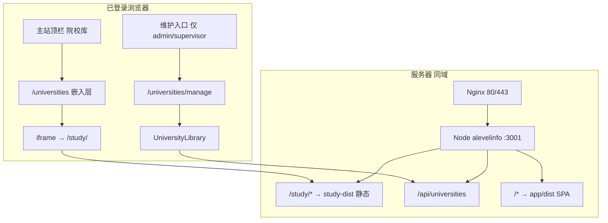

# 院校库与 study-app 集成方案

　　**文档日期**：2026-04-21  
　　**状态**：设计稿（待开发落地）  
　　**相关目录**：`study-app/`（静态探索站）、`app/`（主站 SPA + API）、`app/src/sections/UniversityLibrary.tsx`（院校主数据维护）

---

## 一、目标与原则

### 1.1 业务目标

| 诉求 | 说明 |
|------|------|
| 全员可浏览 | 学生、教务、指导老师、管理员登录主站后，顶栏「院校库」进入 **study-app** 探索界面（地图、对比、指南等）。 |
| 专人可维护 | **指导老师**、**管理员** 另有入口进入现有 **院校库管理** 页，维护 SQLite 中的院校/专业数据，供学生目标院校、雷达图、匹配逻辑使用。 |
| 同域体验 | 不新开独立域名；保留主站顶栏与登录态，避免用户误以为「跳到了别的系统」。 |

### 1.2 技术原则

- **展示与业务分离**：`study-app` 为只读展示层；`UniversityLibrary` + `/api/universities` 为业务主数据层。  
- **最小侵入**：优先 **同域子路径 `/study/` + 主站 iframe 嵌入**，不合并两套 React Router。  
- **权限以 API 为准**：前端隐藏按钮不够；写库接口继续校验 `admin` / `supervisor`。  
- **分阶段上线**：先打通路由与部署；数据同步（JSON ↔ SQLite）作为二期。

---

## 二、现状摘要

### 2.1 主站（`app`）

- 顶栏「院校库」路由：`/universities` → 组件 `UniversityLibrary`（`MainLayout.tsx`）。  
- 权限：`canEditUniversityCatalog` = **admin** 或 **supervisor**（`AuthContext.tsx`）。  
- **学生** 当前导航**不含**「院校库」，且访问 `/universities` 会被重定向回学生仪表盘（`MainLayout` 学生分支）。  
- 生产环境由 Node（`server/index.js`）托管 `app/dist`，Nginx 反代至 `127.0.0.1:3001`；`/api/*` 为 JSON API。

### 2.2 study-app

- 独立 Vite + React 应用，数据来自静态文件：`universities_data.json`、`third_party_summary.json`（`DataContext.tsx` 使用相对路径 `fetch('./…')`）。  
- 当前 `vite.config.ts` 中 **`base: './'`**，适合根路径部署；若挂到 **`/study/`** 子路径，生产构建须改为 **`base: '/study/'`**。  
- 与主站 SQLite **无自动同步**；雷达图、学生目标院校等仍读 API 库。

### 2.3 依赖目录说明（易混淆）

| 目录 | 是否必需 | 用途 |
|------|----------|------|
| `app/node_modules` | 仅 **主站** 开发与服务器 `npm ci` | 运行/构建 `app`（Express + Vite 主站），与 study-app **无关** |
| `study-app/node_modules` | 仅 **study-app** 本地构建时 | 在 `study-app` 内执行 `npm ci` 后生成；**不要**从 `app` 复制或共用 |
| 服务器 `study-dist/` | **不需要** node_modules | 只部署 `study-app` 的 **`dist` 静态文件** |

　　**常见误解**：静态站「缺少 `app/node_modules`」——实际上 study-app **从不依赖** `app/node_modules`。若无法 `npm run dev` / `npm run build`，请在 **`study-app` 目录**安装依赖：

```powershell
Set-Location "D:\1XFAwork\highSCHOOL\A-levelCENTER\Alevelinfo\study-app"
npm ci
npm run build
```

　　一键部署脚本只打包 **`app/`**，且故意排除 `node_modules`；服务器上对 **`app`** 执行 `npm ci` 不会自动安装 study-app 依赖，**study-app 须在本机构建后再上传 `dist`（或 `study-dist`）**。

---

## 三、推荐架构



### 3.1 路由设计（主站 React）

| 路径 | 组件 | 可见角色 |
|------|------|----------|
| `/universities` | `UniversityExploreEmbed`（全高 iframe，`src="/study/"`） | **所有已登录用户**（含学生） |
| `/universities/manage` | 现有 `UniversityLibrary` | **admin**、**supervisor** |

**主站壳层维护入口**（推荐，不依赖静态站识别 JWT）：

- 在 `/universities` 页 iframe **上方** 显示链接：「院校库维护（录入雷达图数据）」→ `/universities/manage`。  
- 仅当 `canEditUniversityCatalog === true` 时渲染。  
- **staff**、**student** 不显示该入口。

**学生导航调整**：

- 在学生 `navigation` 中增加：`{ name: '院校库', href: '/universities', icon: Library }`。  
- 删除或放宽学生访问 `/universities` 时的强制 `Navigate` 到仪表盘逻辑。

### 3.2 嵌入方式

**首选：iframe**

```tsx
// 概念示例（落地时新建 UniversityExploreEmbed.tsx）
<iframe
  title="院校探索"
  src="/study/"
  className="w-full border-0"
  style={{ minHeight: 'calc(100vh - 4rem)' }}
/>
```

| 优点 | 注意 |
|------|------|
| 不改 study-app 内部路由结构 | iframe 内路由为 `/study/explore` 等，与主站 `/universities` 独立 |
| 主站顶栏、登录态保留 | 需配置 `/study/*` 的 SPA fallback，避免子路径刷新 404 |
| 部署边界清晰 | 静态资源 `base` 必须为 `/study/` |

**不推荐作为首选**：顶栏直接 `window.open('/study/')`（脱离主站壳）；或将 study-app 源码并入 `app` 单仓（工作量大）。

### 3.3 静态站托管（生产）

**构建**

```bash
cd study-app
npm ci
npm run build
# 产物：study-app/dist → 部署为服务器上的 study-dist
```

**`study-app/vite.config.ts` 生产配置**

```ts
base: '/study/',
```

**托管方式 A（推荐，与现网一致）**

在 `app/server/index.js` 中，于主站 `express.static('../dist')` 与 `app.get('*')` **之前** 注册：

1. `app.use('/study', express.static(path.join(__dirname, '../study-dist')))`  
2. `app.get('/study/*', (req, res) => res.sendFile(.../study-dist/index.html))`  

服务器目录建议：`/opt/alevelinfo/app/study-dist/`（与 `app`、`dist` 同级）。

**托管方式 B（可选）**

Nginx 增加：

```nginx
location /study/ {
    alias /opt/alevelinfo/app/study-dist/;
    try_files $uri $uri/ /study/index.html;
}
```

API 仍 `proxy_pass` 至 Node；仅静态由 Nginx 直出，减轻 Node 压力。

### 3.4 发布流水线扩展

在现有 `deploy/upload-and-update.ps1` / `remote-update.sh` 流程中增加：

1. 本机：`study-app` 执行 `npm ci && npm run build`（`base` 已为 `/study/`）。  
2. 将 `study-app/dist` 打入部署包，或单独上传到 `app/study-dist`。  
3. 远端解压后无需对 `study-dist` 执行 `npm`（纯静态）。  
4. 主站 `app` 仍执行现有 `npm ci`、`npm run build`、`npm rebuild better-sqlite3`。

---

## 四、权限与安全

### 4.1 角色与能力

| 角色 | `/universities` 探索站 | `/universities/manage` | API 写院校库 |
|------|------------------------|-------------------------|--------------|
| student | ✓ | ✗ | ✗ |
| staff | ✓ | ✗ | ✗ |
| supervisor | ✓ | ✓ | ✓ |
| admin | ✓ | ✓ | ✓ |

### 4.2 未登录访问 `/study/`

　　纯静态目录**无法**读取主站 `localStorage` 中的 JWT。可选策略：

| 策略 | 说明 |
|------|------|
| **务实（一期）** | 不对外宣传 `/study/` 直链；仅通过主站 `ProtectedRoute` 内 iframe 使用；JSON 内容为院校公开信息则可接受。 |
| **加强（二期）** | Express 对 `/study` 做网关校验，或 Nginx `auth_request`；需增加 Cookie/Session 或与主站共享鉴权机制。 |

　　**维护页** `/universities/manage` 必须走主站路由守卫 + 后端 `universities` 路由权限，不得仅靠 iframe 内按钮隐藏。

### 4.3 study-app 内「维护」按钮（可选）

　　若希望在静态站 Navbar 也显示入口：

- 主站 iframe `onLoad` 后 `postMessage({ type: 'host-role', role: user.role })`（**仅 UI**，不作安全依据）。  
- 静态站收到且 `role` 为 `supervisor` / `admin` 时，显示「去维护」：`window.top.location.href = '/universities/manage'`。

---

## 五、数据层关系与演进

### 5.1 当前双数据源

| 数据源 | 用途 | 更新方式 |
|--------|------|----------|
| `study-app/public/universities_data.json` | 探索、对比、生活成本等展示 | 改 JSON + 重新 build study-app |
| SQLite `universities` 表 + 专业表 | 学生目标院校、雷达图、`universityMatchHelpers` | `UniversityLibrary` / API |

　　二者**字段模型不同**，短期内内容可能不一致，需在维护页或探索页加简短说明，避免教务误以为「改探索站即改雷达图」。

### 5.2 分阶段演进

| 阶段 | 内容 |
|------|------|
| **Phase 1** | 路由拆分 + `/study/` 部署 + iframe；维护仍用现有管理页；接受展示与业务数据可能不一致。 |
| **Phase 2** | 维护保存后运行导出脚本，生成 `study-dist/universities_data.json`（或构建前拷贝到 `study-app/public`）。 |
| **Phase 3** | study-app 只读改调 `GET /api/universities`（字段映射 + 分页）；JSON 作离线兜底。 |

　　雷达图、学生详情「目标院校」等**继续只依赖 API/SQLite**，无需 iframe 内写库。

---

## 六、开发任务清单（落地顺序）

### 6.1 study-app

- [ ] `vite.config.ts`：`base: '/study/'`（生产）；本地 dev 可用 `base: '/study/'` 或 proxy 验证。  
- [ ] 确认 `fetch('./universities_data.json')` 在 `/study/` 下可加载（Vite `base` 会作用于相对资源）。  
- [ ] `npm run build`，检查 `dist/index.html` 内资源前缀为 `/study/assets/...`。

### 6.2 主站 `app`

- [ ] 新建 `UniversityExploreEmbed.tsx`（iframe + 可选维护入口条）。  
- [ ] `MainLayout`：`/universities` → Embed；`/universities/manage` → `UniversityLibrary`。  
- [ ] 学生导航增加「院校库」；调整学生路由重定向白名单。  
- [ ] （可选）`postMessage` 与 study-app Navbar 联动。

### 6.3 服务端

- [ ] `server/index.js` 注册 `/study` 静态与 SPA fallback（顺序在全局 `*` 之前）。  
- [ ] 确认 `/api` 与 `/uploads` 不受影响。

### 6.4 部署

- [ ] 扩展 `deploy/upload-and-update.ps1`：构建并打包 `study-dist`。  
- [ ] `remote-update.sh`：解压后保留 `study-dist` 目录。  
- [ ] 上线后验证：`https://域名/study/`、`https://域名/universities`、supervisor 可进 `/universities/manage`。

### 6.5 验收

- [ ] 各角色登录后均可打开 `/universities` 且 iframe 内容正常。  
- [ ] student/staff 无维护入口；supervisor/admin 可维护且 API 拒绝越权写操作。  
- [ ] iframe 内子路由刷新不 404；静态 JSON 加载无 404。  
- [ ] 学生目标院校 / 雷达图仍随 `UniversityLibrary` 维护数据变化（API 路径）。

---

## 七、相关文档索引

| 文档 | 关系 |
|------|------|
| [doc/部署指南.md](doc/部署指南.md) | Nginx、目录约定、发布骨架 |
| [doc/线上更新与数据库维护纪要-2026-04-21.md](doc/线上更新与数据库维护纪要-2026-04-21.md) | 一键上传与 systemd |
| [doc/服务器数据库备份与维护.md](doc/服务器数据库备份与维护.md) | SQLite 备份（含院校库数据） |
| [study-app/README.md](study-app/README.md) | 静态站本地开发说明 |
| `deploy/upload-and-update.ps1` | 现网部署脚本（待扩展 study-dist） |

---

## 八、决策记录（推荐选项）

| 议题 | 决策 |
|------|------|
| 集成方式 | 同域 `/study/` + 主站 iframe |
| 维护页路径 | `/universities/manage` |
| 静态托管 | Node `express.static`（与现网一致）；大规模流量可改 Nginx alias |
| 学生是否可见院校库 | 是 |
| 一期数据同步 | 不强制；双源并存并文档说明 |
| 安全一期 | 依赖主站登录壳；不单独为 `/study/` 做 JWT 网关 |
